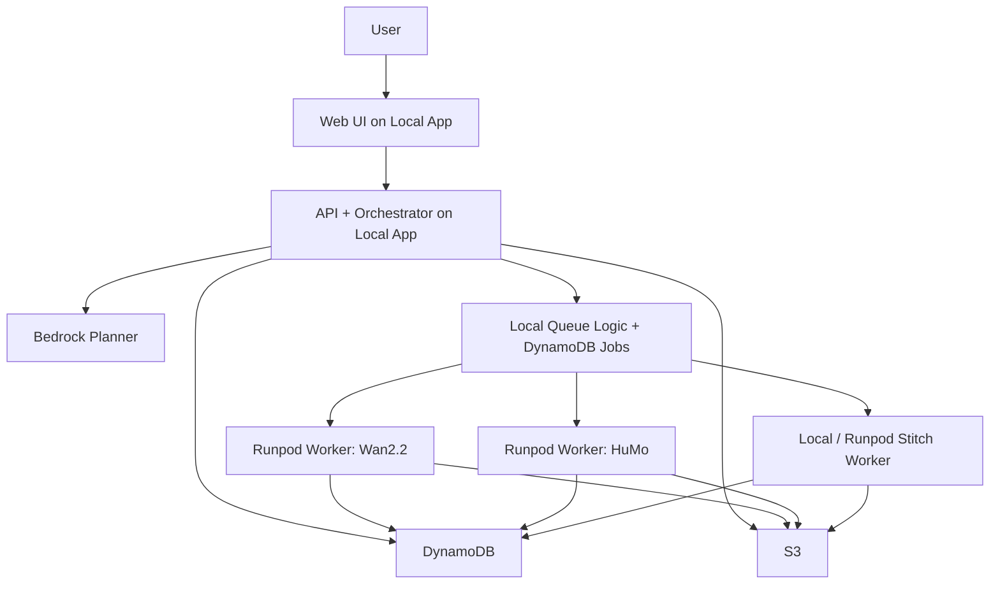

# AWS-Lite + Runpod Implementation Spec

## 1. Constraint

Use only these managed AWS services:

- `S3`
- `DynamoDB`
- `Bedrock`

Use **Runpod** for GPU compute.

Everything else should be built and run by us locally or on Runpod workers.

That means:

- no EC2 for the main GPU path
- no RDS
- no ElastiCache
- no SQS
- no ECS/EKS
- no Lambda

## 2. What Runs Where

### On AWS managed services

- `S3`: asset storage, generated outputs, manifests
- `DynamoDB`: projects, jobs, outputs, continuity, stitch manifests
- `Bedrock`: planning, prompt normalization, shot decomposition, retry prompts

### Locally

- web frontend
- API server
- orchestrator
- local-safe worker logic
- optional local stitch testing with FFmpeg

### On Runpod

- `Wan2.2` worker
- `HuMo` worker
- optional `LTX` preview worker
- model storage on attached pod disk or network volume

## 3. Revised System Shape



## 4. Service Boundaries

### `apps/web`

Runs locally.

Responsibilities:

- project dashboard
- upload UI
- prompt input
- render status
- output gallery

### `apps/api`

Runs locally.

Responsibilities:

- REST API
- asset registration
- job creation
- DynamoDB reads and writes
- S3 signed URLs
- worker coordination

### `apps/worker`

Runs locally for control-plane-safe operations, and later on Runpod for GPU jobs.

Responsibilities:

- validate and execute worker job payloads
- upload outputs to S3
- update DynamoDB job state
- run stitch logic when appropriate

## 5. Queue Strategy

We keep the existing queue design:

- `DynamoDB + polling workers`

Each worker:

1. polls DynamoDB for pending jobs
2. acquires a lease
3. runs the job
4. uploads outputs to S3
5. marks the job complete or failed

This stays the same whether the worker is local or on Runpod.

## 6. Temporary File System

### Local

Use local runtime folders for:

- development artifacts
- FFmpeg stitch tests
- control-plane-safe previews

### Runpod

Use pod-local disk and an attached volume for:

- model weights
- Hugging Face / torch cache
- intermediate frames
- temp renders

S3 remains the system of record.

## 7. Storage Layout

### S3

```text
s3://<bucket>/
  uploads/
    <project_id>/
  references/
    <project_id>/
  previews/
    <project_id>/
  renders/
    <project_id>/
  stitched/
    <project_id>/
  manifests/
    <project_id>/
```

### Runpod volume / pod disk

```text
/workspace/text2video/
  app/
  runtime/
  logs/

/workspace/models/
  wan/
  humo/
  ltx/
```

## 8. Security Model

### Local control plane

Use `.env` for local development credentials.

### Runpod workers

Provide only the credentials they need:

- `AWS_ACCESS_KEY_ID`
- `AWS_SECRET_ACCESS_KEY`
- `AWS_SESSION_TOKEN` if required
- `AWS_DEFAULT_REGION`
- `S3_BUCKET`
- `RUNPOD_API_KEY` when pod automation is needed

## 9. Cost Shape

With this design, your cost comes mainly from:

- Runpod GPU runtime
- S3 storage and transfer
- DynamoDB read/write volume
- Bedrock token usage

The expensive part is now **Runpod GPU time**, not EC2.

## 10. Recommended Build Order

### Phase 1

- local web + api
- S3 uploads/downloads
- DynamoDB schema
- Bedrock planning
- DynamoDB-backed queue

### Phase 2

- one Runpod worker for `Wan2.2`
- worker pulls jobs from DynamoDB
- uploads outputs to S3

### Phase 3

- second Runpod worker for `HuMo`
- preview lane and better routing
- full stitch/output lifecycle
