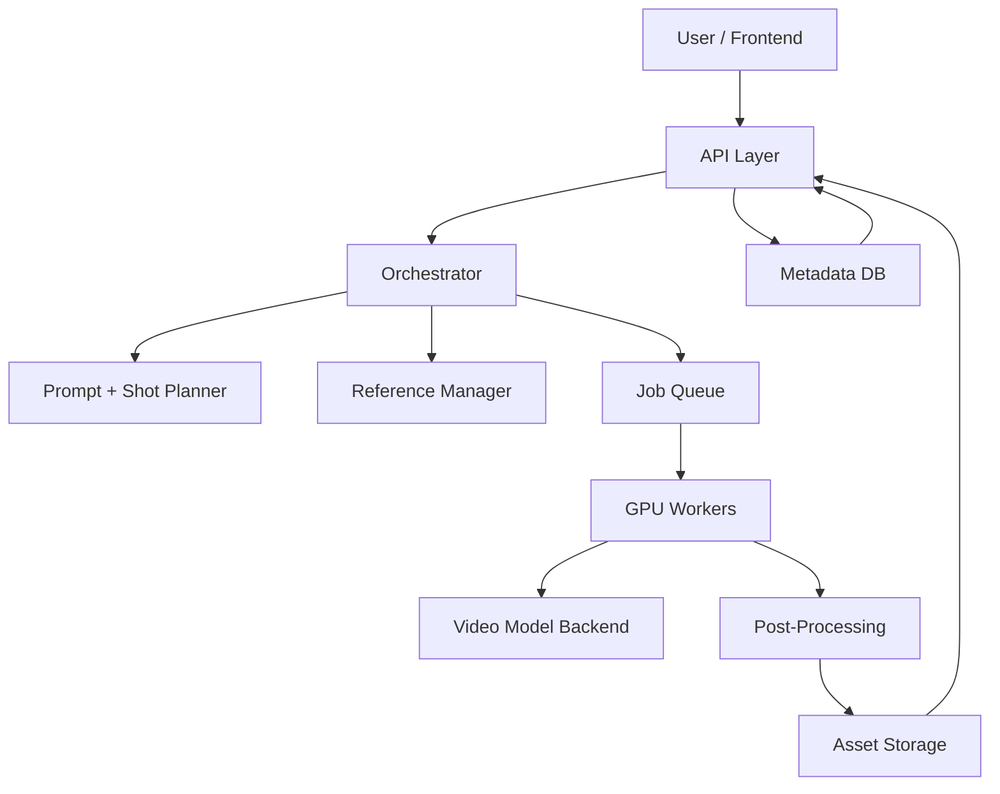

# Research to Architecture: Seedance 2.0-Like AI Video Generation System

## 1. Goal

Build a practical, production-oriented system that can generate cinematic AI videos with strong prompt adherence, controllable camera motion, reference-guided consistency, and an upgrade path toward synchronized audio.

This is **not** a true reimplementation of ByteDance's Seedance 2.0. As of **March 24, 2026**, public evidence indicates Seedance 2.0 is a closed commercial system rather than an openly reproducible model stack. We should therefore design a **Seedance-like product system** on top of open or accessible foundation models.

## 2. What We Are Trying to Match

Based on public descriptions, Seedance 2.0 emphasizes:

- text, image, video, and audio-conditioned generation
- strong character and object consistency
- better motion realism and temporal coherence
- camera direction and cinematic control
- native or tightly coupled audio-video generation

Reference:
- Seedance product page: <https://seeddance.ai/seedance-2-0>

## 3. Reality Check

### 3.1 What is feasible for us

We can build:

- a usable text-to-video and image-to-video product
- multi-stage prompting and shot planning
- reference image conditioning for consistent subjects
- asynchronous generation with retries and evaluation
- enhancement pipelines such as interpolation, upscaling, and extension
- audio generation as a later phase

We likely cannot initially build:

- a frontier proprietary model matching Seedance end-to-end
- a from-scratch multimodal audio-video model without major data and GPU budget
- closed-model-level quality on all prompts in v1

### 3.2 Strategic conclusion

The right approach is:

1. use strong open video foundation models
2. wrap them in an orchestration layer that improves controllability
3. add product features that matter to users before attempting custom training

## 4. Current Open Model Landscape

The architecture should stay model-agnostic, but current candidates are:

### 4.1 HunyuanVideo / HunyuanVideo-1.5

Why it matters:

- strong open video generation baseline
- useful for text-to-video and image/video-conditioned workflows
- good candidate for a primary generation backend

References:
- Paper: <https://arxiv.org/abs/2412.03603>
- Official repository: <https://github.com/Tencent-Hunyuan/HunyuanVideo>
- 1.5 repository: <https://github.com/Tencent-Hunyuan/HunyuanVideo-1.5>

### 4.2 Wan / Wan2.1

Why it matters:

- strong open video generation family
- practical path for open-source-first deployments
- good candidate to benchmark against HunyuanVideo in our stack

References:
- Paper: <https://arxiv.org/abs/2503.20314>
- Official repository: <https://github.com/Wan-Video/Wan2.1>

### 4.3 CogVideoX

Why it matters:

- mature open-source video generation option
- useful as a benchmark or fallback model backend

Reference:
- Official repository: <https://github.com/THUDM/CogVideo>

### 4.4 LTX-Video / LTX-2

Why it matters:

- important if we want faster generation and an eventual audio-video path
- especially relevant if native audio-video generation becomes a v2 priority

References:
- Repository: <https://github.com/Lightricks/LTX-Video>
- LTX-2 paper: <https://arxiv.org/abs/2601.03233>

## 5. Recommended Product Direction

### 5.1 Product statement

We should build a **modular AI video generation platform** with:

- prompt-to-video generation
- optional image reference input
- shot planning and prompt decomposition
- reusable style and character profiles
- asynchronous jobs with preview and final renders
- later support for audio, extension, and editing

### 5.2 Why modular matters

The market and model landscape are moving quickly. A hardcoded single-model app will age badly. A layered architecture lets us:

- swap model backends
- compare quality and cost
- run A/B tests
- add proprietary improvements without retraining a full base model

## 6. Architecture Overview

### 6.1 High-level system



### 6.2 Main components

#### Frontend

Responsibilities:

- accept prompts and reference assets
- allow basic storyboard and shot edits
- show job progress and outputs
- manage project history and presets

Suggested stack:

- Next.js
- Tailwind or a component system with custom styling
- upload UI for images, short videos, and later audio

#### API Layer

Responsibilities:

- authentication
- project management
- asset registration
- job submission
- job status polling / streaming

Suggested stack:

- FastAPI if we want strong Python model integration
- or Next.js + Python worker service if we want a fullstack JS frontend

#### Orchestrator

Responsibilities:

- validate requests
- decompose prompts into shots
- resolve references
- select model backend
- launch jobs and retries
- track artifacts and lineage

This is where most of the product value lives.

#### Job Queue

Responsibilities:

- schedule GPU work
- isolate long-running tasks
- retry failed generations
- separate preview jobs from final renders

Suggested options:

- Celery + Redis
- Dramatiq + Redis
- Temporal if we want stronger workflow durability later

#### GPU Workers

Responsibilities:

- load selected model pipeline
- run inference
- save outputs and intermediate artifacts
- emit telemetry

Workers should be stateless except for model cache and temp files.

#### Post-Processing

Responsibilities:

- frame interpolation
- upscaling
- video extension
- optional face enhancement
- later audio sync, mix, and mux

#### Storage

Use two data layers:

- object storage for images, clips, previews, final videos, logs, masks, latent artifacts if needed
- relational DB for users, jobs, prompts, settings, references, outputs, billing metadata

## 7. Functional Design

### 7.1 Input modes

The system should support these modes over time:

#### Phase 1

- text-to-video
- image-to-video

#### Phase 2

- multi-image reference conditioning
- video-to-video restyling or continuation
- storyboard to multi-shot render

#### Phase 3

- audio-conditioned generation
- native or tightly synchronized audio-video output
- fine-grained editing and scene extension

### 7.2 Prompt decomposition

A single user prompt is often too ambiguous for direct generation. The orchestrator should convert it into a structured representation such as:

- subject
- environment
- action
- camera movement
- lens / framing
- style
- lighting
- duration
- continuity constraints
- negative constraints

For multi-shot projects, the planner should produce:

- shot list
- per-shot prompts
- carry-over entities
- transition notes

### 7.3 Reference handling

Reference inputs should be treated as typed control sources:

- character reference
- object reference
- environment reference
- motion reference
- style reference
- camera reference

This matters because "use this image" is too vague. The user and backend both need explicit control over what each asset contributes.

### 7.4 Consistency strategy

Frontier video quality depends heavily on consistency. We should not rely on the base model alone.

Use a layered approach:

- preserve structured entity metadata per project
- reuse seed and generation settings when appropriate
- support reusable character packs and style packs
- use reference embeddings or adapters where the selected model supports them
- prefer multi-shot planning over fully independent shot generation

## 8. Recommended MVP

### 8.1 MVP scope

Build the first version with:

- user prompt input
- optional single image reference
- 4 to 8 second video generation
- one primary model backend
- async queue
- output gallery and metadata history

### 8.2 Explicit non-goals for MVP

Do not include initially:

- custom training
- native audio generation
- complex multi-shot editing
- multi-tenant billing
- mobile app
- true realtime generation

### 8.3 Why this scope is right

It is narrow enough to ship, but broad enough to validate:

- prompt UX
- queue reliability
- GPU costs
- model quality
- user expectations around references and consistency

## 9. Model Selection Recommendation

### 9.1 Primary recommendation

Start with **HunyuanVideo-1.5 or Wan2.1** as the primary generation backend.

Selection criteria:

- output quality
- inference speed
- VRAM requirements
- ease of deployment
- conditioning support
- license and commercial suitability

### 9.2 Secondary recommendation

Keep the backend interface generic so we can benchmark:

- Backend A: HunyuanVideo-1.5
- Backend B: Wan2.1
- Backend C: CogVideoX or LTX as fallback / experiment

### 9.3 Backend abstraction

Define a common runner interface:

```text
generate_video(
  prompt,
  negative_prompt,
  references,
  duration,
  fps,
  resolution,
  seed,
  guidance_settings,
  model_backend
) -> GenerationResult
```

This keeps the product independent from any single model family.

## 10. Data Model

Core entities:

- `User`
- `Project`
- `Asset`
- `ReferenceBinding`
- `Shot`
- `GenerationJob`
- `GenerationOutput`
- `ModelProfile`
- `StyleProfile`
- `CharacterProfile`

Important metadata to store:

- source prompt
- normalized prompt
- shot prompt
- model version
- seed
- sampler / inference settings
- asset lineage
- failure reason
- preview and final output paths

## 11. API Design

Suggested initial endpoints:

- `POST /projects`
- `POST /assets/upload`
- `POST /jobs/generate`
- `GET /jobs/{id}`
- `GET /projects/{id}`
- `GET /outputs/{id}`

Later endpoints:

- `POST /projects/{id}/shots/plan`
- `POST /jobs/extend`
- `POST /jobs/restyle`
- `POST /audio/generate`

## 12. Infra and Deployment

### 12.1 Environment split

Use separate services:

- web app
- API service
- queue broker
- worker service
- database
- object storage

### 12.2 Deployment path

Recommended progression:

1. local single-machine dev
2. one-GPU staging deployment
3. production with horizontally scaled workers

### 12.3 GPU operations concerns

Plan for:

- model cold starts
- VRAM fragmentation
- job timeouts
- failed generations
- queue backpressure
- output caching

## 13. Evaluation Strategy

We need evaluation from day one, not after launch.

### 13.1 Human evaluation

Score outputs on:

- prompt adherence
- motion realism
- temporal consistency
- subject consistency
- camera quality
- artifact rate

### 13.2 Automated evaluation

Where possible, track:

- generation latency
- failure rate
- cost per generation
- retry rate
- clip-level quality heuristics

### 13.3 Benchmark set

Create an internal benchmark suite of prompts across:

- portraits
- animals
- product shots
- action scenes
- cinematic camera moves
- crowd scenes
- stylized animation

## 14. Major Risks

### 14.1 Quality gap risk

Open models may still lag commercial leaders in consistency and cinematic reliability.

Mitigation:

- strong orchestration
- constrained MVP
- benchmark-driven backend selection

### 14.2 Infrastructure cost risk

Video generation is GPU expensive.

Mitigation:

- short clips only in MVP
- preview-first workflow
- queue-based execution
- strict retention and artifact policies

### 14.3 Product complexity risk

Trying to match every Seedance feature at once will slow us down.

Mitigation:

- phased roadmap
- clear non-goals
- modular backend architecture

### 14.4 Legal and licensing risk

Model license terms, generated media use, and dataset provenance must be checked carefully before commercial launch.

Mitigation:

- verify each candidate model's license before adoption
- keep backend abstraction so we can swap models if needed
- document source model and output lineage

## 15. Build Phases

### Phase 0: Research and baseline

- select top two model backends
- test locally on benchmark prompts
- record quality, speed, VRAM, and failure rate

### Phase 1: MVP

- web UI for prompt + optional image
- API and queue
- single generation backend
- artifact storage
- project history

### Phase 2: Better control

- shot planning
- reusable references
- multi-shot project structure
- extension and enhancement pipeline

### Phase 3: Audio and editing

- music / speech / SFX integration
- audio-video sync
- scene continuation and edit workflows

### Phase 4: Differentiation

- proprietary ranking / retry policies
- custom adapters for specific use cases
- project-level consistency improvements
- template-driven video generation

## 16. Concrete Recommendation

If we were starting implementation next, the best path would be:

1. build a Python-first backend with FastAPI + Redis queue + GPU workers
2. use Next.js for the frontend
3. benchmark **HunyuanVideo-1.5** and **Wan2.1**
4. ship a narrow MVP around prompt-to-video and image-to-video
5. delay native audio until the rest of the generation stack is stable

## 17. Suggested Project Structure

```text
text-2-video/
  apps/
    web/
    api/
    worker/
  packages/
    shared/
    prompt-planner/
    model-adapters/
  infra/
    docker/
    compose/
  docs/
    research-to-architecture.md
```

## 18. Next Step After This Document

The next implementation step should be to scaffold:

- a monorepo or multi-service workspace
- a minimal frontend
- a FastAPI service
- a worker process
- a backend adapter interface for at least one video model

## 19. Source Links

- Seedance product page: <https://seeddance.ai/seedance-2-0>
- HunyuanVideo paper: <https://arxiv.org/abs/2412.03603>
- HunyuanVideo repository: <https://github.com/Tencent-Hunyuan/HunyuanVideo>
- HunyuanVideo-1.5 repository: <https://github.com/Tencent-Hunyuan/HunyuanVideo-1.5>
- Wan paper: <https://arxiv.org/abs/2503.20314>
- Wan2.1 repository: <https://github.com/Wan-Video/Wan2.1>
- CogVideo repository: <https://github.com/THUDM/CogVideo>
- LTX-Video repository: <https://github.com/Lightricks/LTX-Video>
- LTX-2 paper: <https://arxiv.org/abs/2601.03233>
