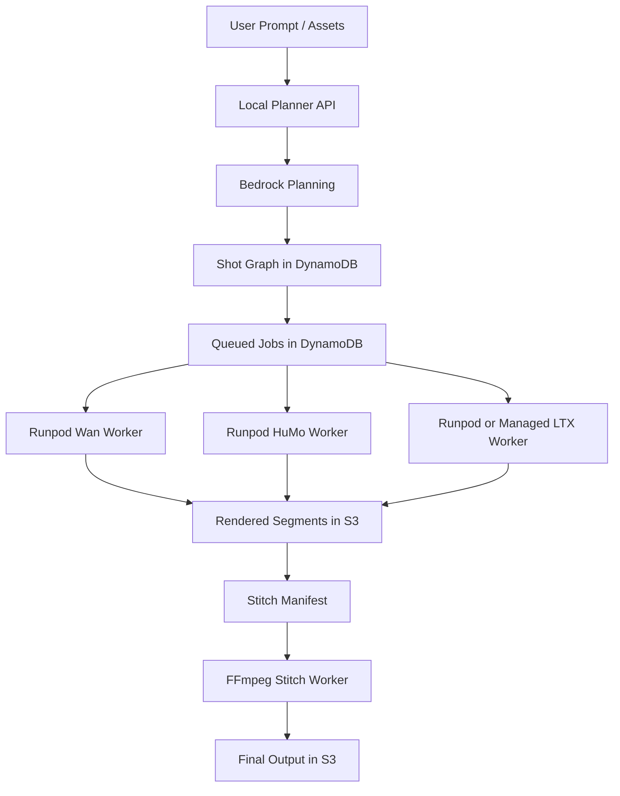

# Seedance-Like Runpod System Design

## 1. Goal

Design a production system that aims for **Seedance 2.0-like output quality** using:

- `Wan2.2 MoE` for high-fidelity core video generation
- `HuMo` for human-centric talking and identity-preserving shots
- `LTX-2.3` for fast preview / AV iteration
- `FFmpeg` for overlap-aware stitching
- `Runpod` for GPU execution
- `S3 + DynamoDB + Bedrock` for the cloud control plane

## 2. Core Principle

Do not use one model for everything.

The best system is:

- Bedrock for planning
- Wan for hero visuals
- HuMo for speaking / human-heavy shots
- LTX for speed and preview
- FFmpeg for deterministic assembly

## 3. Compute Layout

### Local

- frontend
- API
- orchestrator
- queue management
- metadata inspection
- optional local stitch testing

### AWS

- `S3`
- `DynamoDB`
- `Bedrock`

### Runpod

- `Wan` worker
- `HuMo` worker
- optional `LTX` worker

## 4. Pipeline

## 5. Runpod Recommendation

Use Runpod Pods for the first generation path.

Start with:

- one Pod for `Wan2.2`
- attached persistent storage / volume
- SSH or container access for manual bring-up

Add a second Pod for `HuMo` only after the first worker is stable.

## 6. Why This Is Better For You

This keeps:

- the existing AWS control plane
- the current queue and storage design
- the current code structure

while moving the expensive compute layer away from EC2 and into your Runpod account.

That means the rewiring is mostly operational, not architectural.
